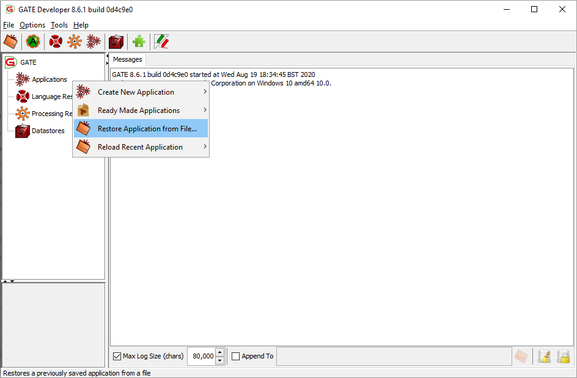
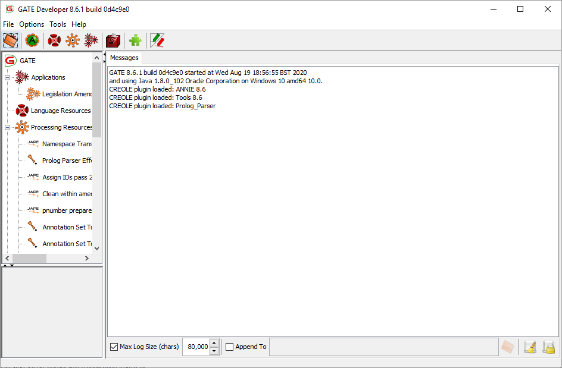
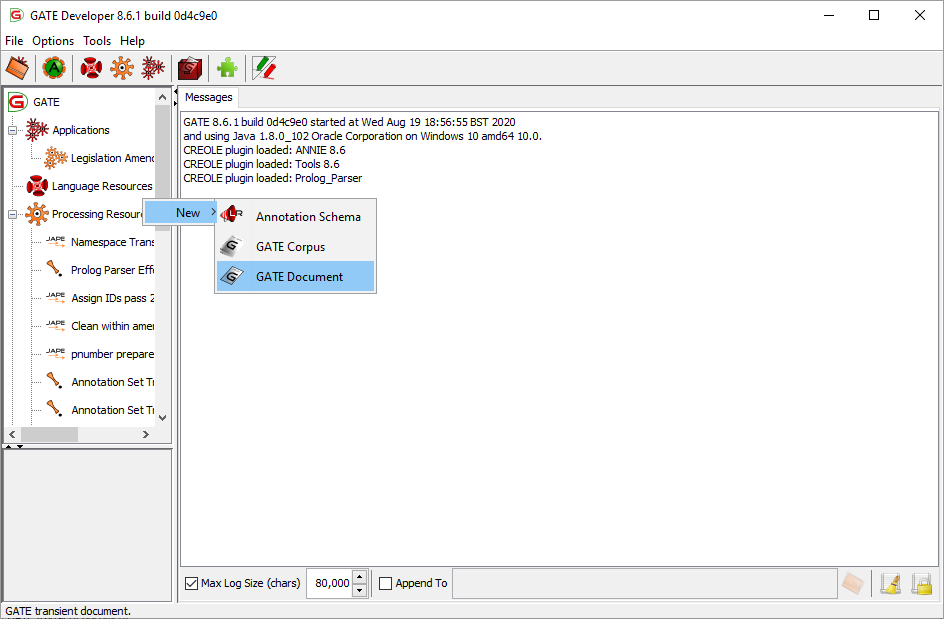
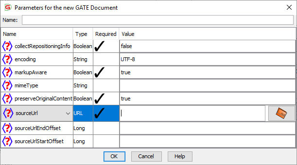
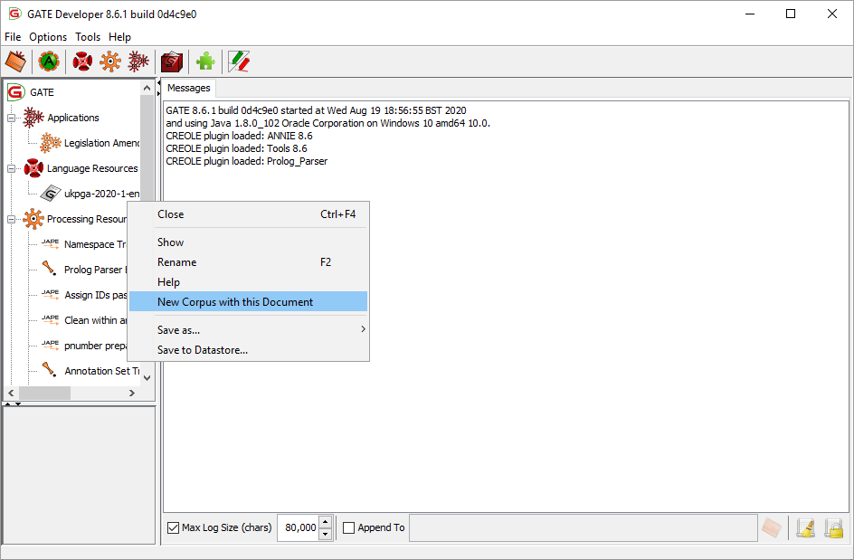
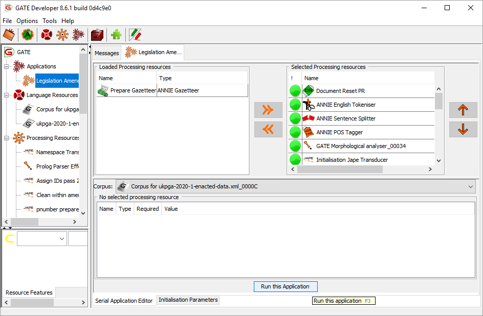
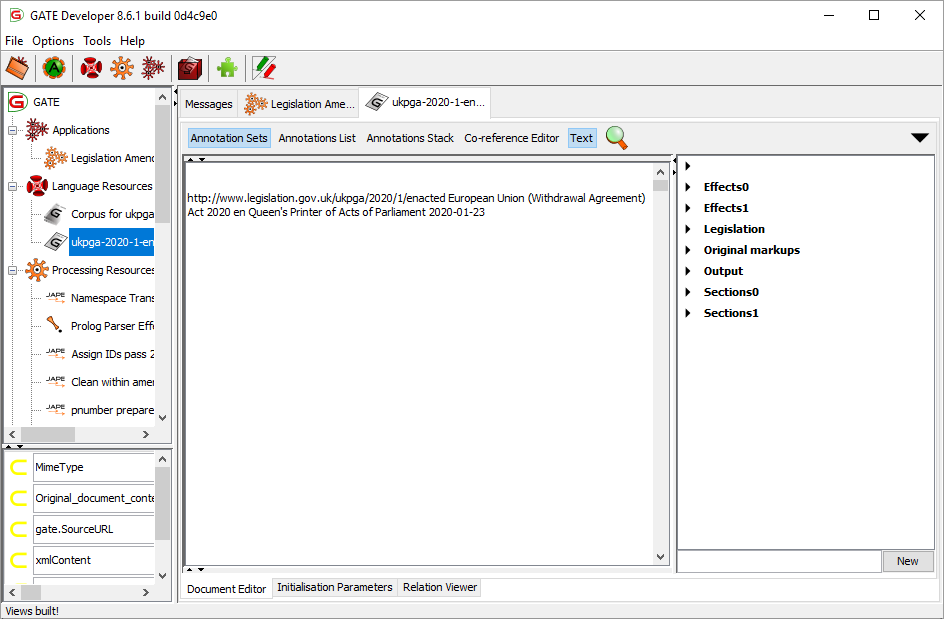
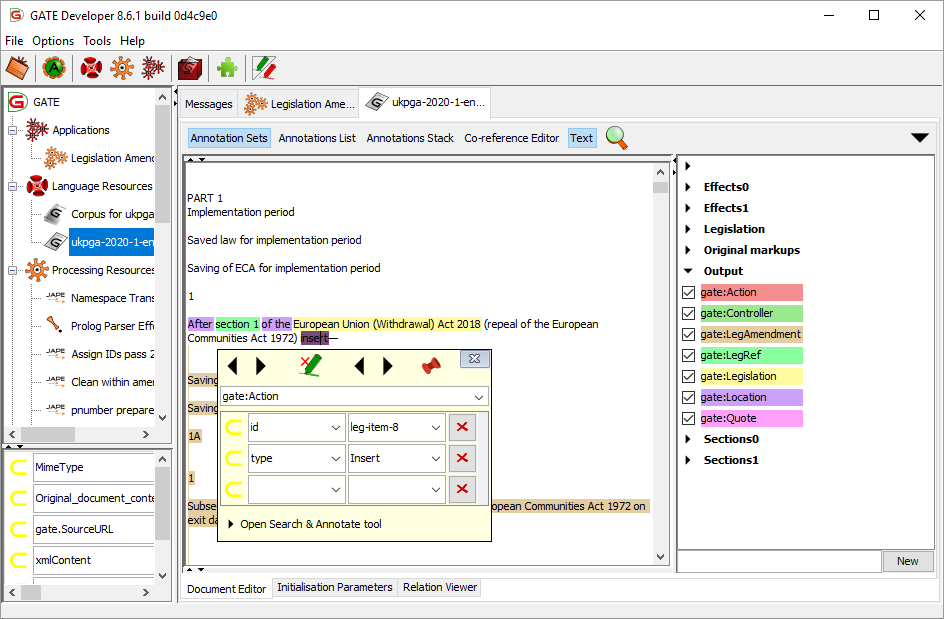
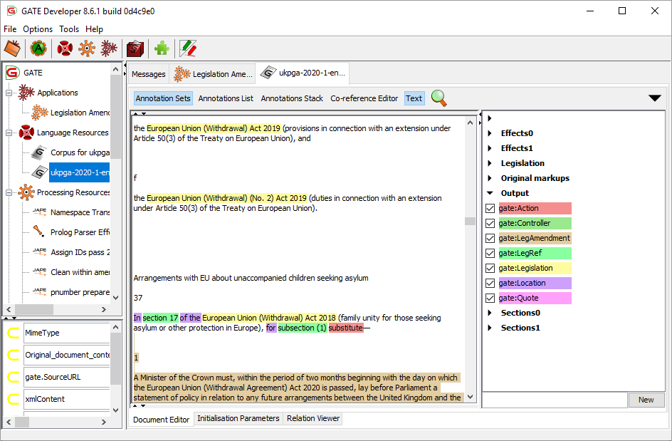

# Legislation Amendments GATE pipeline: Getting Started #

## Introduction ##

This package is a text processing pipeline that uses the [GATE](https://gate.ac.uk) natural language processing framework to parse UK legislation and identify where the text of that legislation makes amendments to other items of legislation.

The Legislation Services team at The National Archives (who are responsible for publishing both original and revised UK legislation) use this pipeline to automatically identify changes to existing legislation that occur as part of new legislation, complementing the work of human editors.

The pipeline comprises a sequence of text processing steps. These steps use legislation-specific [gazetteers](https://gate.ac.uk/userguide/chap:gazetteers), [JAPE rules](https://gate.ac.uk/userguide/chap:jape) and plug-ins implemented in Java code, including a bespoke parser. The outputs of the pipeline are an annotated version of the XML of the input legislation document, plus an XML representation of the amendments made by the document to other items of legislation.

The National Archives run this pipeline within a purpose-built Data Enrichment Service (DES). However, it can also be run separately within the GATE Developer environment (ideal for experimentation) or called from other Java code.  This document gives a simple introduction to the pipeline by running it in the GATE developer environment.

## Installation ##

### Software dependencies ###

* A Java JDK, version 8 or later. You can download a free, open licensed JDK from the [OpenJDK website](https://openjdk.java.net/).
	* **WARNING:** GATE may not run correctly on Java versions above version 11. If you receive an error in the GATE console that says **System.err cannot be resolved to a type**, try installing OpenJDK 11 instead.
* The GATE Developer environment, available from [the GATE download page](https://gate.ac.uk/download). 
	* The Legislation Amendments GATE pipeline package has been tested with GATE 9.0.1. (Earlier GATE versions are unlikely to work with the bundled Prolog Parser plugin.)
* The Prolog Parser GATE plugin, which you can build from source in the `gate-resources/Prolog_Parser/` folder, or is available pre-built from the [releases page of the GATE pipeline repository on Github](https://github.com/legislation/gate-legislation-amendments/releases).
* Apache FOP, available from the [Apache FOP downloads page](https://xmlgraphics.apache.org/fop/download.html).
* Saxon HE, an XSLT execution engine used to run the transforms. You should download [Saxon HE 12.4 from the Saxonica Github page](https://github.com/Saxonica/Saxon-HE/releases/SaxonHE12-4).
* SWI-Prolog 7.7.25 or later, available from the [SWI-Prolog downloads page](https://www.swi-prolog.org/Download.html).

### How to install ###

1. Download and extract the Legislation Amendments GATE package.
	* The directory structure of the package should be as follows: 
	```
	(installation dir)/
		doc/
			(documentation here)
		embedded/
			(sample Java app that embeds the pipeline using GATE Embedded)
		gate-resources/
			(bespoke plugins here)
		LegislationAmendments/
			legislation-amendments.gapp
			gazetteer/
				(legislation gazetteers here)
			NE/
				(JAPE rules here)
		transforms/
			(various transforms to different output formats here)
	```
	* **Note: If you are using Windows and you extract the package to a network drive or share, GATE may fail to load the application.** We recommend that you extract the package to a folder on a local disk instead.
	* If you must save the package onto a network drive or share, you can manually edit the configuration file to point towards the correct location:
		1. Open `LegislationAmendments/legislation-amendments.gapp`.
		2. Find and replace all instances of `$relpath$` with `file://///server/share/path/to/LegislationAmendments/`, where `//server/share/path/to/` is the path to the folder in the network location where you have extracted the package (e.g. if you extracted the package into a folder called `work/gate/` underneath the share `\\filesrv\homedir$`, replace `$relpath$` with `file://///filesrv/homedir$/work/gate/LegislationAmendments/`)
		3. Save the file.
	* This problem appears to result from how GATE handles Windows UNC paths and should not occur on macOS or Linux/UNIX systems.

2. Acquire the Prolog Parser GATE plugin. There are two ways to do this:

  	* **Method 1:** Download the JAR files for the Prolog Parser plugin from our [releases page on Github](https://github.com/legislation/gate-legislation-amendments/releases) (there should be two files, one called `Prolog_Parser-1.0-SNAPSHOT.jar` and the other called `Prolog_Parser-1.0-SNAPSHOT-creole.jar`). Place both these files in a subfolder called `gate-resources/Prolog_Parser/target/` within the top-level folder of this distribution. If the `target/` subfolder does not exist within `Prolog_Parser/`, you must create it.
  	* **Method 2:** Build the plugin from source using the Maven project in the `gate-resources/Prolog_Parser/` subfolder. You will need a Java compiler and Maven to build the plugin.

3. Download and install Apache FOP.

	* You can download the latest version of FOP from the [Apache FOP downloads page](https://xmlgraphics.apache.org/fop/download.html).
	* Download a “Binary Download” version, which are generally named something like `fop-X.X-bin.zip`.
	* The ZIP should contain a folder with a name like `fop-X.X`. Extract **the contents of that folder** (but not the `fop-X.X` folder itself) to the `transforms/fop/` subfolder, so that you have a directory structure like this:

		```
		(installation dir)/
			transforms/
				fop/
					fop/
						build/
						conf/
						examples/
						lib/
						fop
						fop.bat
						fop.cmd
						fop.js
					javadocs/
					KEYS
					LICENSE
					NOTICE
					README
					sls.conf
		```

4. Download and install Saxon HE.

    * This pipeline has been tested on Saxon HE 12.4, which you can download from the [Saxon HE 12.4 release page on Github](https://github.com/Saxonica/Saxon-HE/releases/SaxonHE12-4). (You want the file named `SaxonHE12-4J.zip`.)
    * Create a new `transforms/saxon/` subfolder and extract the contents of the ZIP to it, so that you have a directory structure like this:

	  ```
		(installation dir)/
			transforms/
				fop/
				saxon/
					doc/
					lib/
					notices/
					saxon-he-12.4.jar
					(etc.)
		 ```

5. Download and install GATE. We recommend installing GATE 9.0.1 or newer.
	* **Note:** GATE appears to have bugs that affect its performance on newer macOS systems. In particular, the Resource Features pane (that shows additional metadata relating to a processed document) does not work reliably, so you may struggle to extract the Effects data if you run GATE on macOS. However, most other features appear to work correctly.
	* After installation, you will likely need to change some files in the GATE Developer installation folder for it to work properly. Browse to that folder.
	  * We recommend increasing the amount of RAM available to GATE for optimum performance. If you have at least 4GB of RAM, open `gate.l4j.ini` in a text editor and add on a new line the text `-Xmx2G`. (If you have more than 4GB of RAM, increase the `2` to half of the RAM available in your system.) This will allow GATE to use more RAM, which will mean that it will both run faster and run out of memory less often.

6. Download and install SWI-Prolog.
	* **Note:** The GATE package will look for SWI-Prolog at `C:/Program Files/swipl/bin/swipl.exe` (on Windows) or for an executable called `swipl` in your path (on macOS/Linux/UNIX). If you have installed SWI-Prolog elsewhere, you will need to change the path in the Prolog Parser component's creole.xml file.
	* To specify a new path to SWI-Prolog, open `LegislationAmendments/gate-resources/Prolog_Parser/creole.xml` with a text editor and add the path to the SWI-Prolog interpreter in the `DEFAULT` attribute of the `swiPrologExecutable` parameter:
```xml
<!-- change "C:/path/to/swipl/bin/swipl.exe" to the SWI-Prolog path on your system -->
<PARAMETER 
	NAME="swiPrologExecutable"
	COMMENT="The location of the SWI-Prolog executable"
	OPTIONAL="true"
	DEFAULT="C:/path/to/swipl/bin/swipl.exe"
	RUNTIME="false">java.lang.String</PARAMETER>
```

You should now be ready to run the application in the GATE developer environment.

## In the GATE developer environment ##

If you wish to experiment with the pipeline and inspect the intermediate results, it is best to run it in the GATE development environment. This environment provides an interactive graphical interface. In the following section, we will walk through an example of running a single document through the pipeline in the GATE Developer environment.  

For further information about GATE, please refer to the [GATE website](https://gate.ac.uk/).  

1. Load the pipeline.  

	* Right click on **Applications 🡆 Restore Application from File**.  The GATE application is specified in the file `LegislationAmendments/legislation-amendments.gapp`.

		

	* It should now look like this:

		

2. Load a document.  

	* This is done by right-clicking on the **Language Resources** and selecting **New 🡆 GATE Document**.

		

	* An XML legislation document can be selected by choosing **sourceURL** in the dialog box. **Make sure to choose the correct settings as listed below to ensure GATE parses the document correctly:**
		* **encoding:** UTF-8
		* **markupAware:** true
		* **preserveOriginalContent:** true

		

		If you want an example document to use, you can try https://www.legislation.gov.uk/ukpga/2023/57/enacted/data.xml (you can try pasting the URL directly into the **sourceURL** field, but you may need to download it using a browser and then open the file instead).

3. Add the document to a corpus.  

	* The pipeline runs on a corpus of documents (even when processing a single document), so it's necessary to create a corpus to contain this document.  This is done by right-clicking on the document, and selecting **New Corpus with this Document**.

		

4. Run the pipeline.  
 
	* To do this, double-click the name of the pipeline **Legislation Amendments**.  This presents a view of the pipeline steps (“processing resources”).  Make sure that the correct **corpus** is selected, and click **Run this Application**. 

		

5. Examine the results.

	* The results can be examined by double-clicking on the **document**, and then clicking **Annotation Sets** in the top left corner of the Document Editor.  This brings up the coloured list of annotations on the right of the window.

		

	* It can be seen that there are various annotation sets:

		* **Original markup**, containing the XML markup from the unprocessed document.
		* **Legislation**, containing markups created by the gazetteers and JAPE rules in the pipeline
		* **Sections0, Sections1**, input and output annotations of the sections parser
		* **Effects0, Effects1**, input and output annotations of the effects parser
		* **Output**, containing annotations selected for adding as XML to the output version of the document

	* To show annotations in the document, click on the checkbox next to specific annotation types.  To see additional information (features) relating to a specific annotation, place the cursor on the coloured text and press **Ctrl-e**.

		

	* The annotations in the **Output** annotation set are the ones output into the final marked-up XML.

		

## Output format of the document ##

The pipeline creates a large number of annotations on the document as it runs. The way that the Editorial system uses the pipeline is that:

1. The pipeline configures GATE to add a certain subset of the annotations from the *Output* annotation set into the document when GATE re-exports it as XML.  The exported annotations are:
	* gate:Action
	* gate:Controller
	* gate:LegAmendment
	* gate:Legislation
	* gate:Location
	* gate:Quote

2. The pipeline stores additional information in GATE “features” associated with the processed document. The feature named `xmlContent` contains the “Effects” XML, which describes the amendments to other legislation contained in the text of the document. The Editorial system uses this XML to generate the “tables of effects” (TOES) that editors will use as a guide to produce revised versions of affected documents.
	* You can view this XML yourself by finding the `xmlContent` feature in the **“Resource Features”** pane in the far bottom left of the window, then scrolling right to see the content. You can copy and paste this XML into a text editor for ease of reading or re-use.
	* The Editorial system combines this additional XML and the modified document XML together into a new XML document, which can then be further processed for various output formats.

3. The Editorial system applies XSLT transforms to the output document to generate an annotated PDF and HTML file and a TOES spreadsheet.

To export the marked-up document with the annotations in the list above from within the GATE Developer environment: 

1. Right click on the document in the left hand sidebar and click **Save as… 🡆 Inline XML**.
2. Choose the following settings:
	* **Make sure you manually input a correct file path** in the **Save to:** field as GATE seems to reliably choose an invalid path, and **it will not save the file or warn you if you attempt to save to an invalid path!**
	* **annotationSetName:** Output
	* **annotationTypes:** *(you will need to click the adjacent button to open the dialog, select and remove the existing options, then add each of these in turn)*
		* gate:Action
		* gate:Controller
		* gate:LegAmendment
		* gate:Legislation
		* gate:Location
		* gate:Quote
	* **includeOriginalMarkups:** true
	* **includeFeatures:** true
	* **encoding:** UTF-8
3. Click OK. **Double check the file has saved correctly before closing GATE!** 

To export the identified effects:

1. Double click on the document in the left hand sidebar of the GATE window.
2. In the bottom-left pane of the GATE window, look for the drop-down field with the name `xmlContent`.
3. Select the content of the text field **immediately to the right of** `xmlContent`, then copy it. (You can’t right click on this field, so the quickest way to copy the value is to quickly triple-click the input field, then press Ctrl-C on your keyboard.)
4. Open a new document in a text editor and paste in the copied text.
5. Save the document as an XML file.

To apply the XSLT transformations to generate a PDF and Table of Effects (TOES) spreadsheet:

1. Move the exported marked-up document and the exported effects XML files from the above steps to the `transforms/` folder in the installation folder of this pipeline.
2. Once you have moved the files to `transforms/`, rename both files so that they share a common prefix (e.g. `gated_data`) and the following suffixes:
   * `_doc.xml` for the exported marked-up document (e.g. `gated_data_doc.xml`)
   * `_effects.xml` for the exported effects (e.g. `gated_data_effects.xml`)
3. Open a command prompt or shell in the `transforms/` subfolder.
4. Run the command `postprocess-des-doc.bat [prefix]`, replacing `[prefix]` with the filename prefix you used in step 2 (e.g. `postprocess-des-doc.bat gated_data`).
5. The PDF and Excel spreadsheet should now appear in the `transforms/` folder with the names `[prefix].pdf` and `[prefix]_spreadsheet.xls`.

Note that when you open the spreadsheet in Excel, you will receive a message like the following:

> The file format and extension of '`[prefix]`_spreadsheet.xls' don’t match. The file could be corrupted or unsafe. Unless you trust its source, don’t open it. Do you want to open it anyway?

You should click **Yes** to open the spreadsheet.

This message appears because the file is an Excel XML 2003 format spreadsheet, but we use the `.xls` extension (instead of `.xml`) so that the file will reliably open in Excel on users’ machines. Excel detects and complains about this mismatch, but apart from the above message it does not affect the ability to use the spreadsheet.

## Running the pipeline in an embedded GATE instance ##

You can use the GATE Embedded library to build a Java application or library that embeds a GATE pipeline. A simple example program that uses GATE Embedded to embed the Legislation Amendments application is available in the `embedded/` folder.  

## Further details ##

* Further details of the processing steps are provided in the [technical overview](/doc/overview.md).
* A supplementary spreadsheet mapping the dependencies between annotation sets and between annotations is provided in the file [AnnotationSetsV2.xlsx](/doc/AnnotationSetsV2.xlsx).
