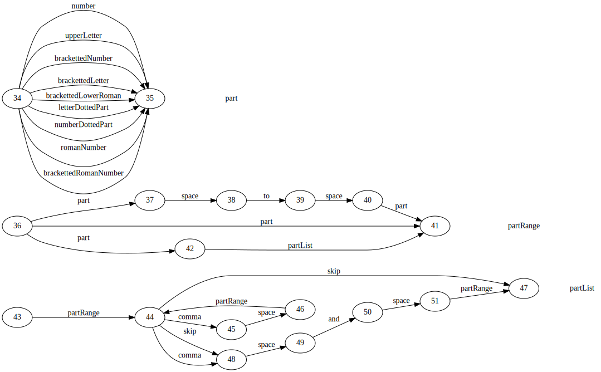
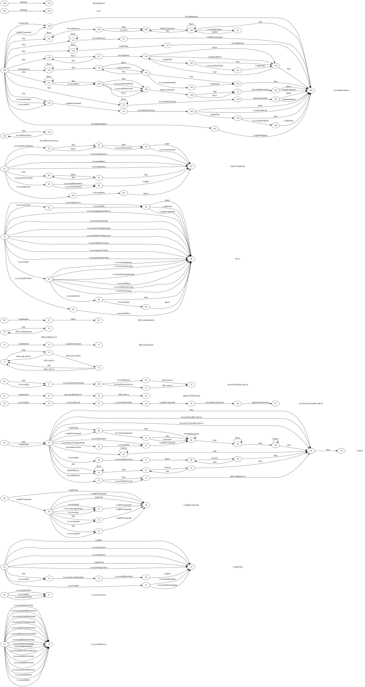

# The Prolog-based Parser #

## Introduction ##

This document describes the Prolog-based parser used at two different stages in the legislation.gov.uk eMarkup GATE Pipeline.  The steps in the pipeline that use this parser are:

- &ldquo;Sections&rdquo; parser.  This identifies citations of provisions, ranges of provisions, and sequences of (ranges of) provisions. It also constructs URI fragments for the provisions.
- &ldquo;Effects&rdquo; parser.  This is the final of stage of processing textual effects, which parses structures of nested contexts potentially across a whole document.  It replaces a bespoke top-down parser written in Java.

## Motivation ##

While the JAPE rule language is used widely in the system, it is not appropriate for every scenario.  For some parts of the process, we wish to use to something closer to a conventional grammar.  This is because we need to parse deep structures, sometimes stretching across a long document, and build specific, complex structures from the parse. 

It is easy to process simple values in JAPE (in the feature maps of annotations&mdash;for example, attaching URI, type, year and number to a detected legislation item). However, there is little support for building structured output (e.g. trees or lists).  Any attempt to build such structures depends on writing Java on the right hand side of JAPE rules, which is working at entirely the wrong level of abstraction.

JAPE allows us to use labels to capture annotations when pattern-matching the left hand side of the rule.  However, this only makes sense if the left hand side pattern is simple.  If the label occurs within operators such as `{+, *, ?}`, a set of bindings is captured, but the context is lost.  Often this necessitates writing Java code on the rule's right hand side to partially re-discover the pattern already matched on the rule's left hand side.  

### Alternative approaches ###

The original LegislationAmendments pipeline included a bespoke parser written in Java.  The main grammar for detecting textual effects was very complex, having around 250 non-terminal categories.  The output from the parser was a syntax tree represented in XML form.  Hence it can include 250 element types.  The processing to extract effects from the syntax was pushed downstream to a complex XSLT transform.

One reason for the complexity of this grammar is that it needs to express the structure of effect phrases while simultaneously keeping track what level of the affected document is being referenced.  The possible structure of the parser output as we move between affecting provisions depends on whether we are focusing in, stepping forward at the same level, or zooming out of the affected document structure.

## Chosen approach ##

For the new 2019 system, a language for the grammar rules was developed that is generalised to express the solution in manner which we consider more appropriate.    

More specifically, we define a separate document structure model which describes possible relations, such as section 🡆 subsection.  We then use an extended grammar formalism which allows for arbitrary tests (e.g. on document structure) and actions (e.g. to build output data structure).  This allows us to use a much smaller grammar, and to dispense with the separate XSLT used by the previous pipeline to extract structure from the XML.  This has been implemented in the Prolog programming language, which allows for rapid development of a customised rule language.

We have opted for an approach which combines EBNF-like representation of the grammar (i.e. we allow equivalents of regular expression operators `+, *, , |, ?` as does JAPE).  JAPE has labels attached to parts the rule pattern, which can be referenced in a single action, which is triggered when the whole rule is matched. Instead of labels in the pattern, our approach attaches actions directly to parts of the pattern, associates with each non-terminal category a feature map (i.e. key-value hash table, a dictionary in SWI-Prolog terminology).  This allows named values to be set and tested within the pattern, which is used for testing internal consistency (c.f. agreement in NLP) and constructing an output structure on-the-fly.  This is essentially an Augmented Transition Network (ATN).  This is an well-established idea in Natural Language Processing, and one that makes only shallow use of the declarative nature of Prolog, but is a pragmatic choice that would allow the run-time part to be re-implemented in Java if it ever becomes a requirement.  The EBNF-like syntax of the rules is compiled into a hierarchy of finite state automata, with tests/actions on the transitions of the automata.  A utility is provided in the code base to create a graphical representation of the automata using the directed graph generation program &ldquo;dot&rdquo;.

We have also reversed the direction in which the rules are written to be more consistent with the common convention for writing grammar rules, which makes more sense when the right hand side of the rule is always a simple symbol (unlike in JAPE rules, where the right hand side can be an arbitrary chunk of Java code).

The parsing algorithm is a bottom-up chart parser.  Unlike typical chart parsers, we reference partially completed grammar rules using the states of the pre-compiled state machines.

The characteristics of the new approach:

- The parsing strategy is bottom-up.  This is appropriate for our problem, where we often fail to exactly parse the whole document, but where we can't do that, we at least want to output the fragments that did parse.
- Parsing and building the output structure occur together in the same rule (unlike the previous parser)
- We abstract out the document structure model from the grammar, which leads to a much smaller grammar.
- Debugging is simplified in the new approach, as identified partial structures can be interactively queried after the parser has completed. 

## Grammar notation ##

The Prolog parser does not contain a parser for a grammar language.  Instead, the grammar must be written in the syntax of Prolog.   Informally, the grammar of the rule language is as follows:

Grammar expansion

- *rule* :== *category* '**\<==**' *expansion_act* **.** 
- *expansion_act* :== *expansion* ( '**:**' *action* )?
  - grammar expansion with associated action or test
- *expansion* :== '**seq(**' *expansion_list* '**)**'
  - Sequence 
- *expansion* :== '**disj(**' *expansion_list* '**)**'
  - disjunction, equivalent of '
- *expansion* :== '**?(**' *expansion_list* '**)**'
- *expansion* :== '**+(**' *expansion_list* '**)**'
- *expansion* :== '**\*(**' *expansion_list* '**)**'
- *expansion* :== *category*
- *expansion_list* :== '**\[**' (*expansion_act* ('**,**' *expansion_act* )\*)?  '**\]**' 

Actions:
 
- *action* :== *var* '**:=**' *expr* 
	- assignment to *var*
- *action* :== *var* '**:==**' *expr* 
   - if *#var* unbound then assign value of *expr* to *var*, else test *#var* already bound to value of *expr*
- *action* :== *var* '**+=**' *expr* 
   - Append value of *expr* as element to *#var*.  Equivalent to *var* :=append(#*var*,list(*y*)).
- *action* :== '**if(**' *action*, '**\[**' *action*, ... '**\]**', '**\[**' *action*, ... '**\] )**'
   -  if action in 1st arg succeeds, execute action list in 2nd arg, else execute action list in 3rd arg
- *action* :== '**try(\[**' *action*',' ... '**\] )**'
   -  Execute actions in list.  In case of failure, undo actions and continue.
- *action* :== '**assigned(**' *expr* '**)**'
  - Test succeeds if *expr* can be evaluated (e.g. doesn't use values of unbound variables).
- *action* :== '**fn(**' *expr1*, ..., *exprN* '**)**' 
  - Evaluate each of *expr1, ..., exprN* to give *val1, ..., valN*, then call a Prolog goal *fn(val1, ..., valN)* This provides a simple hook for deterministic Prolog goal used as a test, e.g. *expr* **=** *expr* .

Expressions:

- *expr* :== '**@**'*name* 
   - value from item featuremap
- *expr* :== '**#**'*name*
   - value from rule featuremap
- *expr* :== '**(@)**'
   - whole item featuremap
- *expr* :== '**(#)**'
  - whole rule featuremap
- *expr* :== *expr* '**~**' *expr* 
   - default value - if first *expr* has value then return it, else return second *expr*.
- *expr* :== *expr* '**+**' *expr* 
   - symbol concatenate.
- *expr* :== '**fn(**' *expr1*, ..., *exprN* '**)**' 
  - Evaluate each of *expr1, ..., exprN* to give *val1*, ..., *valN*, then call a Prolog goal *fn(val1, ..., valN, ValOut)* as though it is function returning value *ValOut*.  This provides a simple hook for language extensions, but the Prolog goal must be deterministic, binding its last argument.
 

Document model:

- ***docpart* => *docsubpart*** - The operator **=>** has been used to build relations expressing direct containment relations between document components (e.g. section => paragraph2).
- ***docpart* =>> *docsubpart*** - The transitive closure of **=>** - giving direct *or indirect* containment relations.  

### Example

The following is a large proportion of the grammar for provision citations.

	part ==> disj([
		number:[ptype:=number,text:= '/'+(@label)],
		upperLetter:[ptype:=upperLetter,text:= '/'+(@label)],
		brackettedNumber:[ptype:=brackettedNumber,text:= '/'+(@label)],
		brackettedLetter:[ptype:=brackettedLetter,text:= '/'+(@label)],
		brackettedLowerRoman:[ptype:=brackettedLowerRoman,text:= '/'+(@label)],
		letterDottedPart:[ptype:=letterDottedPart,text:= '/'+(@label)],
		numberDottedPart:[ptype:=numberDottedPart,text:= '/'+(@label)],
		romanNumber:[ptype:=romanNumber,text:= '/'+(@label)],
		brackettedRomanNumber:[ptype:=brackettedRomanNumber,text:= '/'+(@label)]
	]).
	
	partRange ==> disj([
		seq([ part:[ptype:= @ptype,list:= list((@text)+'/rangeStart')],
   			space,to,space,
 			part:[#ptype = @ptype,list:= collect((@text)+'/rangeEnd',#list)] ]),
		seq([ part:[ptype:= @ptype,text:= @text],
			partList:[#ptype => @ptype,list:= map_prepend(@list,#text)] ]),
		part:[ptype:= @ptype,list:= list(@text)]
	]).
	
	partList ==> seq([
		partRange:[ptype:= @ptype,list:= @list],
		*(seq([ comma,space,partRange:[#ptype= @ptype,list:=append(#list,@list)] ])),
		?(seq([ ?(comma),space,and,space,partRange:[#ptype= @ptype,list:=append(#list,@list)] ]))
	]).

This is compiled into a state machine representation as follows:

## Underlying algorithm

The automata representation of the rules is processed using a standard chart parser algorithm (e.g Jurafsky & Martin, Gazdar & Mellish).  It is not so standard to use it with a grammar represented as a state machine, but it is a good fit.  This is a simple but powerful approach that is very flexible as to the strategy used&mdash;there is minimal change to be made to switch between a top-down and bottom-up strategies, or to use a mixture of both. 

Chart parsers build a table (chart) of partially parsed fragments.  Each entry (*edge*) in the chart spans between specific points in the text (just like GATE annotations), and also records a state of the parse.  Conventionally, the state of the parse is an indication of how far we have progressed through the body of a partially-matched grammar rule.  In our case, the state of parse is simply a reference to state in the state machines, together with a feature map.

This is represented in the Prolog's internal database with a fact like: *edge(P0,P1,V,S)*, where *P0* and *P1* are the start and end points in the document, *V* is the current state machine vertex, and S is a featuremap (to use GATE terminology, it is a set of key-value pairs implemented with the SWI-Prolog &ldquo;dictionary&rdquo; datatype). 

## Bridging gaps in text

As with JAPE, when we base rules on a subset of annotations, we are not usually interested in the gaps between the end of one relevant annotation and the start of the next relevant annotation.  As we need to retain the original absolute text locations, we have code to add some &ldquo;gap&rdquo; annotations whose purpose is to indicate to the parsing algorithm where to advance to the next interesting location in the text.  This is required in the effects parser (which may be need to step over large chunks of irrelevant text) but not in the sections parser (where all relevant annotations must be contiguous in the text). 

## Retry strategy

The effects parser should be capable of parsing structures across whole documents, but while the language used in describing textual amendments tends to follow patterns, it also frequently contains terminology or nomenclature that the system does not recognise.  In this situation, the main priority is to prevent a failed parse on part of a document to break the continuity around it.  The bottom-up strategy partially mitigates this, but typically the effects parsed after the failure lose the context (e.g. to which legislation and which provision the current text is referring) that was mentioned before the break.  As a retry strategy, we mark sub-provisions in which parsing failed with empty structures, and allow a second pass in which these can be stepped over.

## Integration with GATE

The integration with Prolog is done simply through writing relevant annotations to XML files and calling Prolog as an external process.  The mapping of annotation to/from XML is done via a plugin which specifies which Prolog code to run.

The use of intermediate files provides an easy pathway to detailed debugging, since they can be used in an interactive Prolog session, allowing queries to be run on the parsed fragments.  Where an expected result is not detected, it is possible to discover easily exactly where it failed.

## Pitfalls

**Different featuremaps do not imply different states.** For efficiency reasons, the parser only allows one edge of the form `edge(P0,P1,V,S)` for any unique combination of *<P0,P1,V>*.  This *nearly* always gives the expected result, but differences in *S*  (which holds the feature map) can be significant.  If it is necessary to hold simultaneous different sets of register values, then one must write the rules so that these are represented by distinct states in the FSM.  An example of this is the rule for LegRef, where we need to force a distinct state for every values of class.

**Runaway processing on sequences.** For any sequence of similar items, simple bottom-up chart parsing can suffer a combinatorial explosion, as all sub-sequences are valid parses and will be labelled as such.  The number of sub-sequence rises with the square of the length of the encompassing sequence.  This can impact performance, and for the one place where this problem has become apparent in our grammar, we have introduced a small tweak that allows some specific rules to be annotated to execute with a locally top-down strategy.  The effect of this is that the sequences are only be built forwards when triggered by finding a contextually acceptable beginning.  In general, mixing top-down and bottom-up strategies can make it difficult/impossible to ensure completeness of the search.

## Debugging

### Running Prolog interactively

As data is passed between GATE and Prolog in the form of XML files, it is easy to use the file passed into Prolog in an interactive Prolog session, which allows querying of the discovered structures.  By default the file is automatically removed, but there is setting which will allow it to be preserved.

For example, to run an interactive session processing effects:

1. Open a SWI-Prolog interactive session
2. Change directory to location of the Prolog source:
	`cd('/path/to/LegislationAmendments/gate-resources/Prolog_Parser/chart_parser').`
3. Load the code: `[debug_load_effects].`
4. Run the parser on filein `dispatch('filein.xml','fileout.xml').`
5. Output an XML representation of the effects `effect_output('effects.xml').`

The input file in step (4) is an XML representation of GATE annotations generated by the Prolog_Parser plugin.  The easiest way to obtain this is to capture it from the relevant temporary folder.  The location is environment-dependent.  On windows, it is `C:/Users/{username}/AppData/Local/Temp`.  The files passed to and from the Prolog parser are reported in the messages tab in GATE Developer.  The temp folder location and the persistence of temporary files on completion is controlled by the settings in `creole.xml` in the `Prolog_Parser` plugin.

### Generating a visualisation of the state machines

The structures recorded by the parser make use of numbered states.  These are best understood by viewing a visual representation of the state machines generated from the grammar rules.  The visualisation can be generated by running some utility code, which outputs a `.dot` file, suitable for processing into a graphical file format such as .svg using the GraphViz dot program.

1. Load the code `[dot_fsm].`
2. After running parser (which includes compilation of the rules to FSM), run `dot_fsm.`  This generates a graph description in dot format in a file `graph.dot`.
3. From a command shell, run the the dot program, `dot -Tsvg graph.dot -o graph.svg`  This generates an svg file which can be viewed in a browser.

The state machines for the effects parser are shown below.

### Building the syntax tree

The syntax tree can be constructed automatically by the parser.  By default, this is suppressed, because the final output is a constructed feature structure.  However, it can be useful for debugging, and this is controlled by the setting of the `debug` flag in the debug loader.